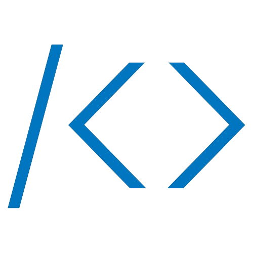

# Welcome to my Profile

## My Stack & skills

|  | 공사중 |
| --- | --- |
| Language |    
| OS |    |
| Board & MCU |     |
| DB |     |
| Other Skill |   |

## Project
| 제목 | 주소 |
| --- | --- |
| 스마트 세탁기 : 자동 세제 조절 시스템 | https://www.notion.so/ByungChan-Lee-e56109ff9be24947830d10ec8d29729e?p=f4586baebf8f495f9e3340e4882bf061&pm=c |
| AVR을 활용한 가정용 세탁기 | https://github.com/BChanGod/AVR_WashingMachine |
| tangramplay AI와 OpenCV를 활용한 칠교 놀이 |  |
| TrafficSign AI와 OpenCV를 활용한 표지판 인식 및 속도 제어 |  |
| AI를 활용한 산불 감지 수막 시스템 | https://github.com/BChanGod/2024_ICT_Project |
| MCU-KIT를 활용한 헬스 케어 시스템 | https://github.com/BChanGod/HealthCareSystem |

## Connect me

  
#  Baekjun & Github 

  

  

<!---
BChanGod/BChanGod is a ✨ special ✨ repository because its `README.md` (this file) appears on your GitHub profile.
You can click the Preview link to take a look at your changes.
--->
